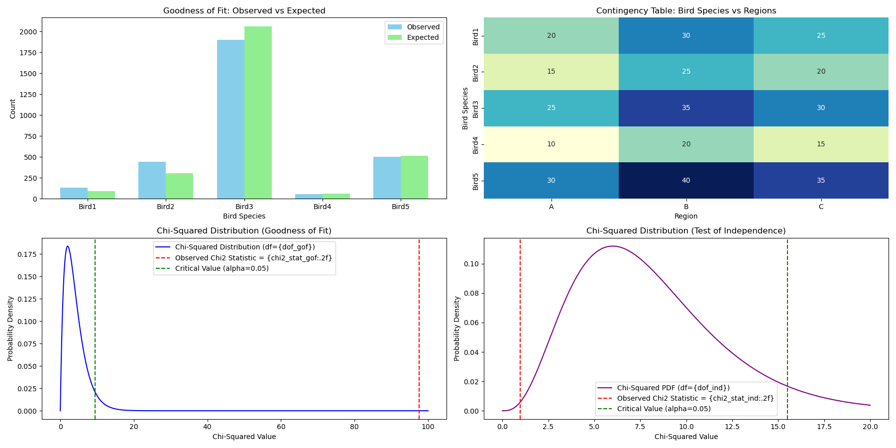

# Statistical Analysis Project - Chi-Square Distribution and Tests

This repository documents my self-learning process in statistics, focusing on the Chi-Square Distribution and Chi-Square Tests. The project covers two key types of Chi-Square tests:

1. **Goodness of Fit Test**: To evaluate if the observed frequencies match the expected frequencies.
2. **Test of Independence**: To determine if two categorical variables are independent.

### Topics Covered:
- **Chi-Square Distribution**: Understanding the theoretical curve and how it's applied in hypothesis testing.
- **Chi-Square Goodness of Fit Test**: Used to compare observed data against a specific expected distribution.
- **Chi-Square Test of Independence**: Used to test whether two categorical variables are independent of each other.

### Project Objective:
- **Learn and Apply Chi-Square Tests**: This project focuses on implementing and understanding the application of Chi-Square tests for various data analysis scenarios.
- **Visualizations**: Both the Chi-Square Goodness of Fit and Test of Independence results are visualized with bar plots, heatmaps, and distribution curves.

### Key Features:
- **Goodness of Fit Test**: Visualizes the comparison between observed and expected frequencies.
- **Test of Independence**: Displays a heatmap for the contingency table and a Chi-Square distribution curve for hypothesis testing.
- **Chi-Square Distribution**: Visualizes the theoretical distribution of Chi-Square and shows critical values for hypothesis testing.

### Files in this Repository:
- `Chi_figure.png`: Contains visualizations of both the Chi-Square Goodness of Fit and Test of Independence tests.
- `Test_ChiSquare.py`: Python script implementing the Chi-Square tests and generating the visualizations.

### How to Use:
1. Ensure that you have Python and the required libraries installed (e.g., `numpy`, `matplotlib`, `seaborn`, `scipy`).
2. Run the script `Test_ChiSquare.py` to execute the tests and generate the images.
3. Visualizations will be saved as `Chi_figure.png` in the current directory.

### Example Image:
The following is an example of the visualization output (saved as `Chi_figure.png`):

