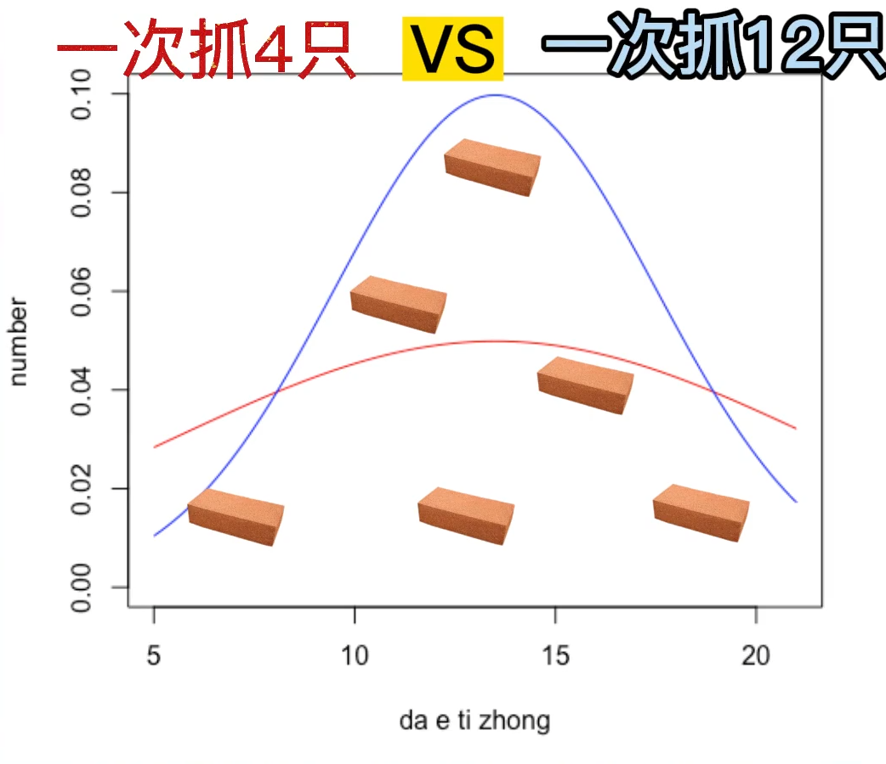

# Understanding Key Statistical Concepts

---

## 1. How to Understand Data Types in Statistics?

There are four main types of data in statistics, explained with examples:

- **What brand of bag did you buy?** (e.g., Hermès, Gucci, LV)  
  → This is **Nominal Data**, where categories are distinct and unordered.

- **What is your education level?** (e.g., Bachelor’s, Master’s, PhD)  
  → This is **Ordinal Data**, where categories have a logical order.

- **How many movies did you watch?** (0, 1, 2, etc.)  
  → This is **Discrete Data**, numerical values that can be counted.

- **What is your height?** (e.g., 160 cm, 170 cm, 180 cm)  
  → This is **Continuous Data**, numerical values that can take any value within a range.

**Summary:**

- **Nominal Data** and **Ordinal Data** are types of **Categorical Data**.
- **Discrete Data** and **Continuous Data** are types of **Numerical Data**.

---

## 2. How to Understand Probability Distribution?

Suppose we survey movie attendance across different screenings, recording how many people attend each showtime.  
The collection of these possibilities and their frequencies forms a **probability distribution**.

A probability distribution includes:

- All possible outcomes
- The probability associated with each outcome

In practice:

- A **histogram** can visualize the distribution.
- A **Probability Density Function (PDF)** describes it smoothly, where the area under a section of the curve represents the probability for that range.

---

## 3. How to Understand the Central Limit Theorem?

Imagine a village chief who wants to estimate the average weight of geese but cannot weigh all of them.  
Instead, he randomly selects a few geese, weighs them, calculates the average, and repeats this process many times.

His son records the sample averages, stacking a brick for each occurrence within an interval.  
Over time, they build a wall that is higher in the middle and lower on the sides.  
When increasing the sample size for each selection, the wall becomes sharper and taller in the center.

Even if the true weight distribution of the geese is irregular or multi-peaked,  
as long as the sampling is **independent and random**, and the sample size is **sufficiently large**,  
the distribution of the sample means will approximate a **normal distribution**.

**Essence of the Central Limit Theorem (CLT):**

> Regardless of the original population distribution,  
> the distribution of sample means approaches a normal distribution with sufficient independent random samples.

**Practical Application:**

- In **linear regression**, one assumption is that the error terms follow a normal distribution — justified by the Central Limit Theorem.

# 统计学基础理解

---

## 1. 如何理解统计学中的数据类型？  
**How to Understand Data Types in Statistics?**

统计学中的数据类型可以分为四类，对应以下实例：

- **你买了什么包？**（如爱马仕、Gucci、LV……）  
  - 包的品牌属于**定类数据（Nominal Data）**，是彼此独立、无顺序的类别。

- **你的学历是什么？**（如本科、硕士、博士……）  
  - 学历是具有顺序特征的**定序数据（Ordinal Data）**。

- **看电影的场次数？**（0、1、2……）  
  - 场次是可以计数的**离散数据（Discrete Data）**。

- **你的身高是多少？**（160 cm、170 cm、180 cm……）  
  - 身高是可以取无限可能值的**连续数据（Continuous Data）**。

**总结：**

- **定类数据（Nominal）** 和 **定序数据（Ordinal）** 属于**类别型数据（Categorical Data）**。
- **离散数据（Discrete）** 和 **连续数据（Continuous）** 属于**数值型数据（Numerical Data）**。

---

## 2. 如何理解概率分布？  
**How to Understand Probability Distribution?**

以调查电影院的上座人次为例：

- 统计不同电影场次的上座人数，并记录每种上座情况出现的频率。
- 各类上座人次及其发生可能性的集合，就构成了**概率分布**。

概率分布包含两部分内容：

- 所有可能发生的事件。
- 每个事件发生的概率。

实际应用：

- 可以绘制柱状图，横轴为上座人次，纵轴为发生的次数。
- 若用一条连续曲线描述，可以通过曲线下某一段的面积表示该区间的概率。
- 这条曲线即为**概率密度函数（Probability Density Function, PDF）**。

---

## 3. 如何理解中心极限定理？  
**How to Understand the Central Limit Theorem?**
> 村长想要统计村里大鹅的平均体重，但是把全村的大鹅全部抓起来称重又比较不现实，于是他在村东头抓了四只大鹅称了重，又在村西头抓了四只大鹅算了平均。
> 发现村东头和村西头的大鹅平均体重并不相同，村长为了算出平均体重，决定在村里随机抓大鹅，称重后算平均，放回去，再继续随即抓，称重算平均，放回去。
> 村长的儿子拉来了一车砖头，把算得的大鹅体重从8斤到18斤分为了10个区间，村长每一次算出的平均，儿子都会在对应的区间垒起一块砖头。
> 最后两人筑起了半堵墙，发现墙的形状是中间高，两边低。二人决定改进一下方案，每次抓12只大鹅，又筑起了半堵墙，发现墙的形状不变，但是中间更高，两边更低了。
> 村长想，要是之后收成不一样了，不同体重的大鹅要是体重更分散，这方法还管不管用。于是第二天，村长挨家挨户让村民称重，统计大鹅的体重，发现实际的分布是两个峰，村西头和村东头的体重不一致。
> 但是算出来的总体平均依然在中间，只要尽可能多的重复独立采样放回，得到的大鹅体重，一定是符合大鹅总体平均墙的形状。
> 不论总体分布如何，多次独立采样放回，得到的平均值分布都符合正态分布。而且总体平均值，可以用样本平均值来估计。
> 线性回归中的基本假设，就是误差项符合正态分布，可以理解成误差项是很多误差来源的总和，不管误差来源的分布如何，误差的总和都符合正态分布，这也是中心极限定理的一个应用。

举例说明：

- 村长想统计村里大鹅的平均体重，但抓全村称重不现实。
- 先在村东头、西头各抓4只大鹅，结果不一致。
- 改用随机抽样：抓几只大鹅，称重、计算均值后放回，继续抓新的样本。
- 村长的儿子把样本均值分区，每次取样后在相应区间垒砖，形成“墙”。

观察：

- 多次抽样后，墙的形状**中间高、两边低**，像一座小山。
- 增加每次抽样数量（比如12只大鹅），墙形状更**尖锐集中**。
- 

更进一步：

- 总体分布可以任意形状（如多峰），依然适用。
- 只要**独立采样**且**样本量足够大**，**样本均值的分布趋近正态分布**。

**总结：**

- **中心极限定理（Central Limit Theorem, CLT）**：  
  不论总体分布形态如何，多次独立随机抽样的**样本均值分布**趋向于**正态分布**。

**应用场景举例：**

- 在线性回归中，基本假设之一是**误差项服从正态分布**。
- 通过中心极限定理理解为：即使单个误差来源不服从正态分布，多个误差叠加后，会趋向正态分布。

